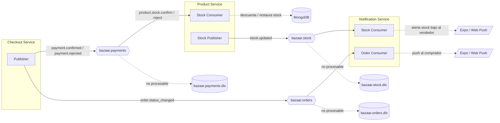
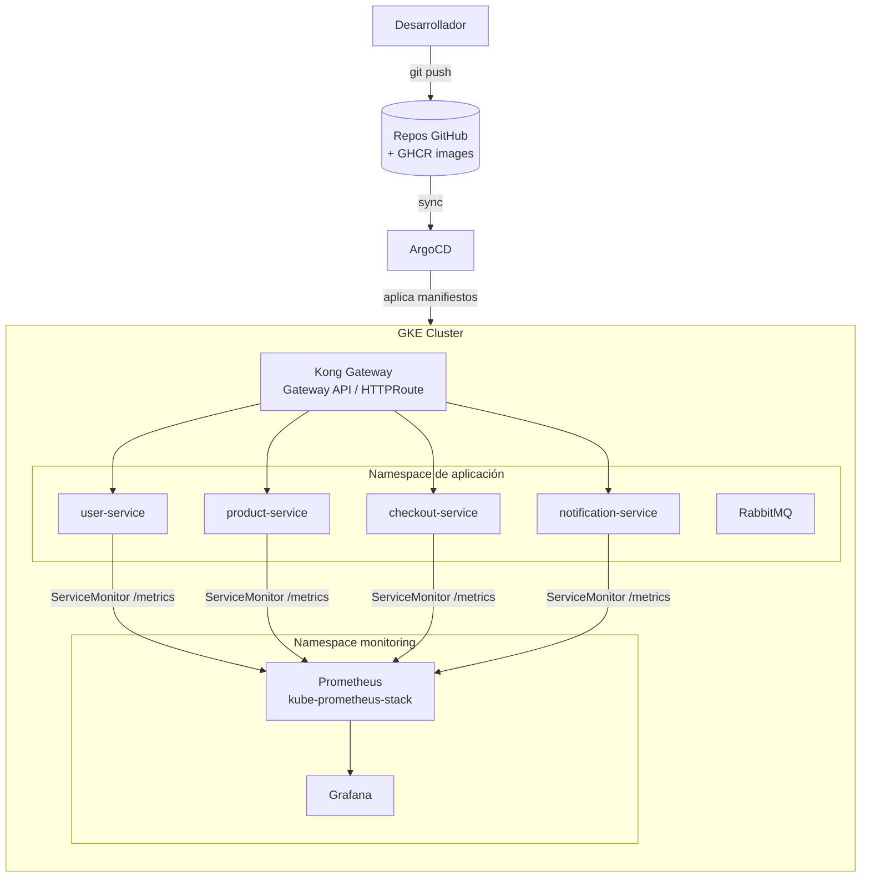

# Diagramas C4 — Bazaar

Documentación de arquitectura del sistema **Bazaar** siguiendo el [C4 Model](https://c4model.com/):
**Contexto (Nivel 1)**, **Contenedores (Nivel 2)** y **Componentes (Nivel 3)**.

Los diagramas se generan desde un **único modelo** en [`workspace.dsl`](workspace.dsl)
([Structurizr DSL](https://docs.structurizr.com/dsl), la herramienta oficial del modelo C4) y se
renderizan con **Kroki** al construir el sitio. Cada vista sale del mismo modelo cambiando solo el
`view-key`, así que basta editar el DSL para mantener todas las vistas en sincronía.

> Bazaar es un marketplace donde cualquier usuario puede comprar y vender. El sistema está
> construido como una arquitectura de **microservicios poliglota**, con comunicación **REST
> sincrónica** (a través de un API Gateway) y **mensajería asincrónica orientada a eventos**
> (RabbitMQ) para los flujos donde la consistencia eventual es aceptable (stock, notificaciones).

---

## Stack tecnológico

| Contenedor | Tecnología | Persistencia | Comunicación |
|---|---|---|---|
| **mobileApp** | React Native + Expo (TypeScript) | SecureStore (local) | REST → Kong |
| **backoffice** | React + Vite + TailwindCSS (TypeScript) | — | REST → Kong |
| **user-service** | Python · FastAPI · SQLAlchemy · Alembic | PostgreSQL | REST + (servidor) |
| **product-service** | Python · FastAPI | MongoDB | REST + RabbitMQ |
| **checkout-service** | Python · FastAPI · SQLAlchemy · Alembic | PostgreSQL (Supabase en prod) | REST + RabbitMQ |
| **notification-service** | Go | MongoDB | REST + RabbitMQ + Push |
| **lib-moniobs** | Python (lib compartida) | — | Sentry / health / middleware |
| **API Gateway** | Kong 3.9 (OSS, Gateway API) | — | Ingress HTTP |
| **Message Broker** | RabbitMQ 3.13 | — | AMQP (topic + DLX) |
| **Infra** | GKE · Helm · ArgoCD · Prometheus · Grafana | — | GitOps |

---

## Nivel 1 — Diagrama de Contexto

Vista de alto nivel: **quién** usa Bazaar y con **qué sistemas externos** se integra.

```kroki-structurizr view-key=Contexto
@from_file: arquitectura/workspace.dsl
```

---

## Nivel 2 — Diagrama de Contenedores

Vista de las **unidades desplegables** dentro de Bazaar y cómo se comunican entre sí.
Cada microservicio es dueño exclusivo de su base de datos (*Database per Service*).

```kroki-structurizr view-key=Contenedores
@from_file: arquitectura/workspace.dsl
```

---

## Mensajería — Topología de eventos

La comunicación asincrónica usa **RabbitMQ** con tres *topic exchanges* durables, cada uno con
su *Dead Letter Exchange* (DLX) para mensajes no procesables.



**Saga de stock (consistencia eventual):** el checkout no descuenta stock directamente. Al
confirmarse/rechazarse un pago publica `payment.confirmed` / `payment.rejected`; el
**product-service** consume el evento y ajusta el stock de forma idempotente (con `event_id`).
Esto desacopla el cobro del descuento de stock y permite reintentos sin doble efecto.

---

## Nivel 3 — Diagramas de Componentes

### Checkout Service (componentes)

El servicio más complejo: orquesta carrito, checkout transaccional, órdenes, cupones, reviews y métricas.

```kroki-structurizr view-key=Componentes-Checkout
@from_file: arquitectura/workspace.dsl
```

### Product Service (componentes)

```kroki-structurizr view-key=Componentes-Product
@from_file: arquitectura/workspace.dsl
```

### User Service (componentes)

```kroki-structurizr view-key=Componentes-User
@from_file: arquitectura/workspace.dsl
```

### Notification Service (componentes)

```kroki-structurizr view-key=Componentes-Notification
@from_file: arquitectura/workspace.dsl
```

---

## Infraestructura y despliegue

Despliegue sobre **Google Kubernetes Engine (GKE)** con modelo **GitOps**.



- **API Gateway:** Kong 3.9 OSS con *ingress controller* (Gateway API / `HTTPRoute`). Punto de
  entrada único; el cliente nunca habla directo con un microservicio.
- **GitOps:** ArgoCD (`infra/argocd`) sincroniza el chart `helm/bazaar-service` por servicio
  (`.argocd-source-*.yaml`). Imágenes publicadas en **GHCR** (`ghcr-pull` secret).
- **Observabilidad:** `kube-prometheus-stack` (Prometheus + Grafana + kube-state-metrics). Cada
  servicio expone un `ServiceMonitor` y `/metrics`. Dashboards versionados en
  `helm/grafana-dashboards`. La librería compartida **lib-moniobs** integra **Sentry**,
  *health checks* y *middleware* de observabilidad en los servicios Python.
- **Broker:** RabbitMQ desplegado vía `helm/rabbitmq`.
- **Despliegue local:** cada servicio trae su `compose.yml` que levanta el stack completo
  (servicio + dependencias + RabbitMQ + Mongo/Postgres). `MERCADOPAGO_MOCK_MODE=true` permite
  correr el checkout sin pegarle a MercadoPago real.

---

## Decisiones de arquitectura relevantes

| Decisión | Detalle |
|---|---|
| **Microservicios poliglotas** | Python/FastAPI para dominio transaccional; Go para el servicio de notificaciones (alta concurrencia de consumo de eventos y *fan-out* de push). |
| **Database per Service** | Cada servicio es dueño de su DB. PostgreSQL donde importa la transaccionalidad (user, checkout); MongoDB donde el modelo es flexible y orientado a documentos (product, notification). |
| **API Gateway único (Kong)** | Centraliza enrutamiento, TLS y *rate-limiting*. Desacopla a los clientes de la topología interna. |
| **Mensajería event-driven (RabbitMQ)** | Stock y notificaciones se resuelven por eventos (consistencia eventual), desacoplando el checkout del product y notification. *Topic exchanges* + **DLX** para resiliencia. |
| **Saga de stock por eventos** | El stock se descuenta cuando product-service consume `payment.confirmed`, no en el checkout. Idempotencia por `event_id` evita doble descuento ante reintentos. |
| **Pago externo desacoplado** | Cliente de MercadoPago con *retry* + *circuit breaker* y modo mock. Idempotencia de pago para evitar doble cobro ante errores de red. |
| **Identidad federada vía Supabase** | Google OAuth delegado a Supabase; reduce el manejo directo de credenciales de terceros. |
| **GitOps con ArgoCD** | Estado declarativo del cluster en Git; despliegue reproducible y auditable. |
| **Librería de observabilidad compartida** | `lib-moniobs` unifica Sentry, health y métricas en los servicios Python, evitando duplicación. |
